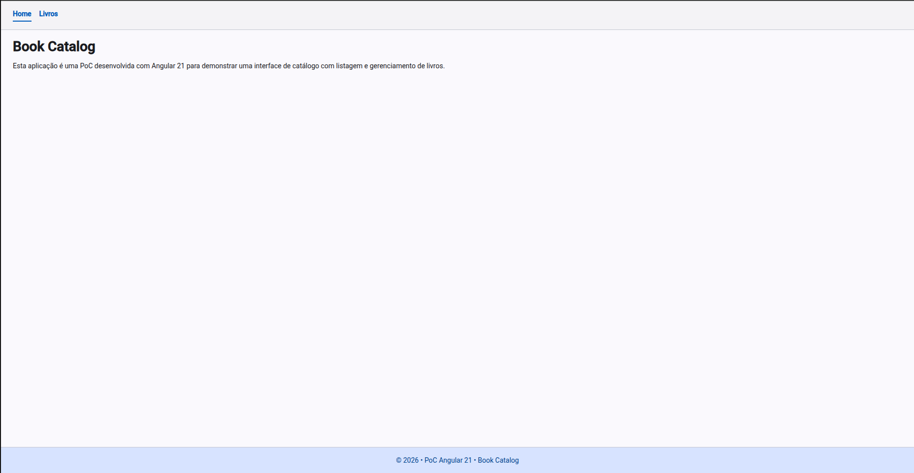
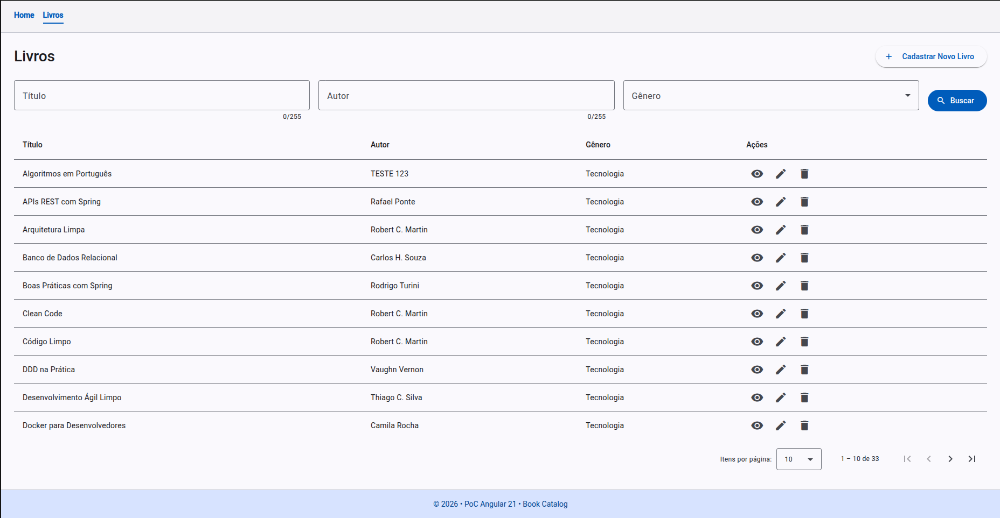
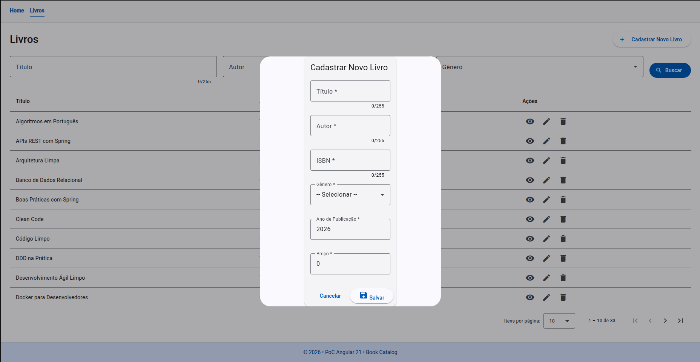
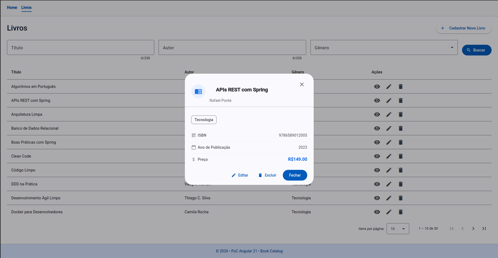

# Book Catalog Web

Frontend de catálogo de livros, desenvolvido com o intuito de realizar uma POC do Angular 21 e Angular Material.

## Visão geral

Esta aplicação permite:

- listar livros com paginação;
- filtrar por título, autor e gênero;
- cadastrar, editar e excluir livros;
- visualizar detalhes do livro.

## Stack

- Angular 21
- Angular Material 21
- TypeScript 5
- SCSS

## Backend

Repositório da API backend: https://github.com/matheusrodriguesf/spring-boot-book-catalog

## Pré-requisitos

- Node.js 20+
- npm 11+
- API backend rodando localmente em `http://localhost:8080`

## Configuração da API (proxy)

O app usa `proxy.conf.json` para redirecionar chamadas de `/api/*` para `http://localhost:8080`.

Exemplo:

- frontend chama `GET /api/livros`
- proxy envia para `GET http://localhost:8080/livros`

## Como rodar localmente

1. Instale as dependências:

```bash
npm install
```

2. Inicie a aplicação:

```bash
npm start
```

3. Acesse no navegador:

`http://localhost:4200`

## Scripts disponíveis

```bash
npm start     # sobe o projeto em modo desenvolvimento
npm run build # gera build de produção
npm run watch # build contínuo (watch)
npm test      # executa testes
```

## Rotas principais

- `/` → Home
- `/livros` → Listagem e gerenciamento de livros

## Estrutura resumida

```text
src/app/
	features/
		home/
		livros/
			livros-list/
			livros-create/
			livros-details/
	models/
	services/
	shared/
```

## Screenshots e demonstração


### Home



### Listagem de livros



### Cadastro/Edição



### Detalhes



